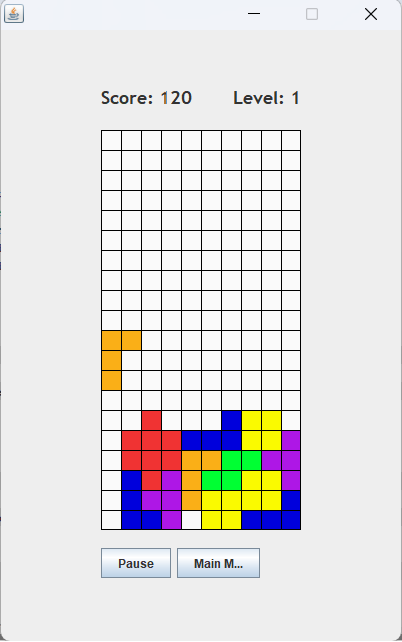
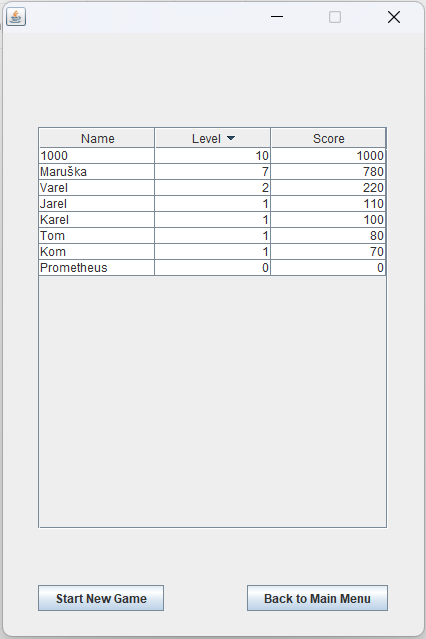

# Tetris
Yet another Tetris game, but this one was made by me. Mostly by searching the internet on how to do it, as one should.

## Sample
It kinda looks like this

and saves a leaderboard which looks like this

In general, everything works just like you would expect from the original game.

## Design
There are three JFramForms in total: WelcomeForm (WF), GameForm (GF) and LeaderboardForm (LF).

The player is introduced to the WF where they have a choice to either start a new game, show their local leaderboard or quit the program.

In the GF, the game is played using arrow keys for block movement and "P" to pause the game. There is also a button where one can pause the game manually and two labels display the current score and level. Once the game is over, the player is asked to enter their name which is subsequently saved in the leaderboard.

In the LF, the leaderboard is displayed. A player can either return to the WF or start a new game, which runs in an instance of GF. The leaderboard is sorted by levels and scores of individual players.

## Functionality
### WelcomeForm.java
This form contains three buttons, which set it invisible and either set visible the GameForm, the LeaderboardForm, or quit the app. Pretty much all the functionality is autogenerated by netbeans.

### LeaderboardForm.java
Here, the leaderboard is displayed. Again, there are two automatically generated buttons which just switch forms. The content of a DB where the leaderboard is stored is loaded into a table and manipulated via an instance of DefaultTableModel, which sorts the leaderboard data.

### Database.java
This class is meant to deal with the game's leaderboard, namely creating one, if it doesn't already exist, saving and loading it, adding new players. Since I am an absolute beginner with DBs, the functionality is very basic.

### GameForm.java
The game runs in this form. It has access to an instance of GameThread and GameBoard, which are initiated as the form starts. Actions are assigned to hotkeys and score and level are updated using this class's methods.

### GameBoard.java
Contains a 2D array of type Color, which serves as the game's background, tetrominos are visualized by recoloring the background every few miliseconds.

The GameBoard also holds access to an instance of class Tetromino. The exact shape is chosen via an object of class Random and spawned somewhere (this is also precisely determined by a random integer) around the middle of the board. Then in every iteration of the game loop, it is checked whether the tetromino got out of bounds or whether it can move in the direction the player chose, see *checkBottom*, *checkLeft*, *checkRight*. When the teromino cannot fall anymore, it is drawn as a part of the background and a check runs, whether there are lines to be cleared. If any are cleared, the current colored cells move one line down for each line cleared.

### Tetromino.java
A 2D array of *0*s and *1*s, representing the initial shape of the tetromino. Where there is *1*, color will be painted. With it comes an array of 2D arrays which represent all four possible rotations of the shape.

This class determines how the tetromino spawns:
- What shape it will be (just like in the original game, the color is interlinked with the shape)
- In which rotation it will spawn
- Where it will spawn, it can be from *-2* to *2* from the middle, indices *3* to *6*.

### GameThread.java
This is whre the game loop runs. `while ( true )` was the choice here, because i do not know any better. It is initialized with
- an instance of GameBoard
- ane instance of GameForm
- integers for score and level
- integer for how long a period of the loop should take
- a boolean for pausing and unpausing the game

Once the game ends, the method GameOver is called asking the player to enter their name, then the loop ends with the *break* command.

### Some notes on playability
While making the most adictive game ever wasn't the goal here, I (a very mediocre tetris player myself) tested some aspects of the game. It seems that a good setting is as follows:
- the loop loops every 500 miliseconds on level 1
- for clearing lines, the player is awarded as follows

| Lines cleared | 1 | 2 | 3 | 4 |
| ----------- | ----------- | ----------- | ----------- | ----------- |
| Score increment | 50 | 70 | 100 | 150 |

- with every new level reached, the loop goes a little faster, precisely
`period -= ( 1 / (double)divisor ) * 20;`
where the divisor is the current level, thus the period effectively stops at around 400 miliseconds
